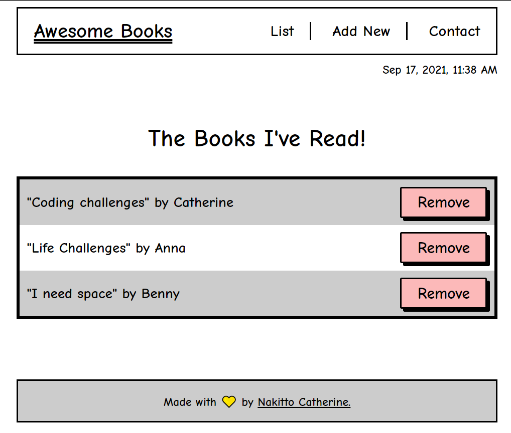
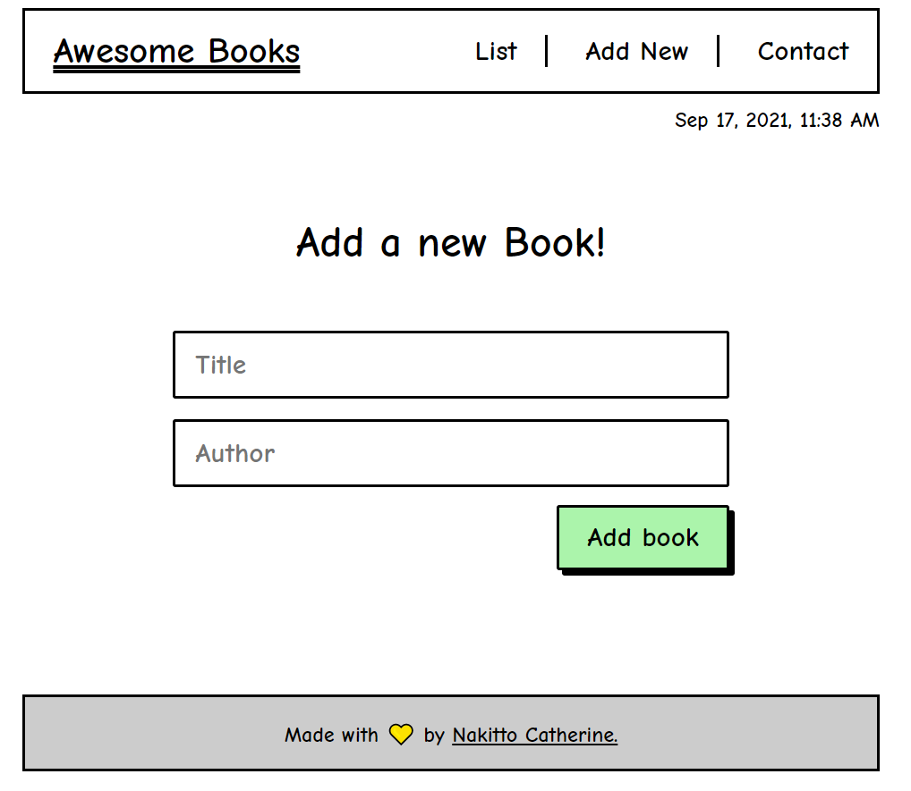
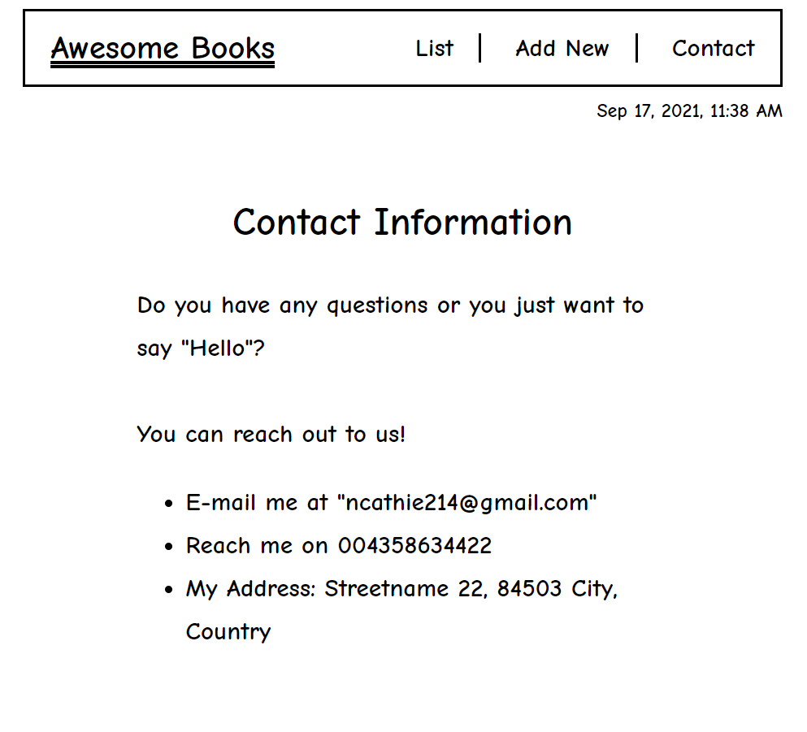

# BooksApp

> Building a single page application using Javascript classes, methods and DOM manipulation.

> Form section

> ontact section

## Technologies

-  HTML, CSS3, JavaScript

## Live Demo

[Live Demo Link](https://cathella.github.io/BooksApp/)

### Prerequisites
A modern browser where javascript is enabled.

## 🤝 Contributing

Contributions, issues, and feature requests are welcome!

Feel free to check the [issues page](https://github.com/Cathella/BooksApp/issues).

## Show your support

Give a ⭐️ if you like this project!

## Acknowledgments

- I would like to thank the designer who design this website [Cindy Shin](https://www.behance.net/adagio07) [design guidelines,](https://www.behance.net/gallery/29845175/CC-Global-Summit-2015) 

## 📝 License

This project is [MIT](./MIT.md) licensed.
